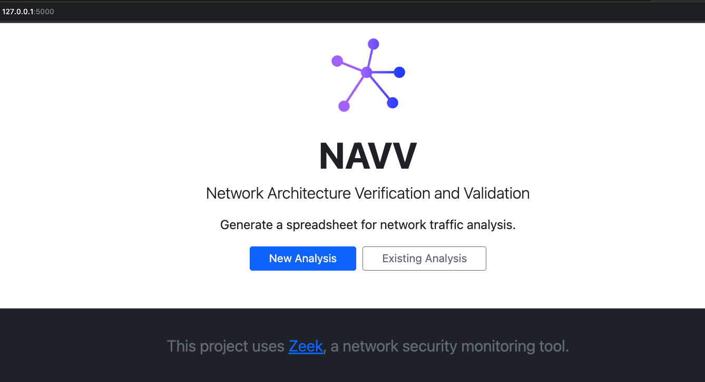
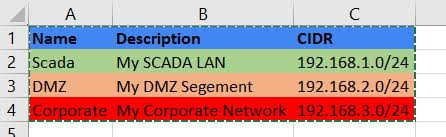

# NAVV #

The **NAVV** (**N**etwork **A**rchitecture **V**erification and **V**alidation) tool creates a spreadsheet for network traffic analysis from PCAP data and Zeek logs, automating Zeek analysis of PCAP files and the collation of Zeek logs to create a summary or network traffic in an XLSX-formatted spreadsheet. After manually updating the spreadsheet with names and color codes for network segments (by CIDR-formatted address groups) and hosts (by IP address), running the tool again will integrate these labels and color coding into the spreadsheet to aid in conducting an evaluation of the network traffic. 

* [Requirements](#Requirements)
* [Installation](#Installation)
    * [Development](#Development)
    * [Production](#Production)
* [Usage](#Usage)
    * [CLI](#CLI)
    * [Browser](#Browser)
    * [Analysis](#Analysis)
* [Docker](#Docker)
* [Copyright](#Copyright)
* [Contact](#Contact)

[](https://pypi.python.org/pypi/navv/)
[](https://github.com/cisagov/network-architecture-verification-and-validation/actions)

## Requirements ##

- This project only works on Linux or MacOS environments
- Zeek must be installed: [Get Zeek](https://zeek.org/get-zeek/)
- Python version 3.10 or later
  - As installation of Python varies from platform to platform, please refer to the [Python.org Wiki](https://wiki.python.org/moin/BeginnersGuide/Download) to install and configure Python on your system.

## Installation ##

### Development ###

If you intend to develop the NAVV tool:
- Verify you have the Zeek tool installed
  - [Install Zeek](https://zeek.org/get-zeek/)
- Clone this repository
  - `git clone https://github.com/cisagov/network-architecture-verification-and-validation.git`
- Setup your local virtual environment
  - `python3 -m venv .venv`
- Activate your local environment
  - `source .venv/bin/activate`
- Install the project and its dependencies to your local virtual environment
  - `pip install -e .`

### Production ###

If you would like to use the NAVV tool, its recommended you install it from PYPI
- Verify you have the Zeek tool installed
  - [Install Zeek](https://zeek.org/get-zeek/)
- Install the project using `pip`
  - The recommended method for installing packages with `pip` is using [User Installs](https://pip.pypa.io/en/stable/user_guide/#user-installs) which installs to a user-specific location rather than system-wide.
  - install the latest version of NAVV
    - `pip install -U navv`
  - or install a specific version of NAVV
    - example:  `pip install -U navv==3.0.1`

Verify the NAVV tool has been installed by running `navv` in your console:

```shell
NAVV: Network Architecture Verification and Validation 3.2.2
Usage: navv [OPTIONS] COMMAND [ARGS]...

  Network Architecture Verification and Validation.

Options:
  --version   Show the version and exit.
  -h, --help  Show this message and exit.

Commands:
  generate  Generate excel sheet.
  launch    Launch the NAVV GUI.
```

## Usage ##

### CLI ###

To run the NAVV tool in the CLI (Command Line Interface), Run the command: `navv generate`

Below are the available options and commands for `navv generate`:
```shell
Usage: navv generate [OPTIONS] CUSTOMER_NAME

  Generate excel sheet.

Options:
  -o, --output-dir TEXT  Directory to place resultant analysis files in.
                         Defaults to current working directory.
  -p, --pcap TEXT        Path to pcap file. NAVV requires zeek logs or pcap.
                         If used, zeek will run on pcap to create new logs.
  -z, --zeek-logs TEXT   Path to store or contain zeek log files. Defaults to
                         current working directory.
  -h, --help             Show this message and exit.
```

### Browser ###

To launch the NAVV tool in the browser, simply run: `navv launch`

This will automatically launch the tool into your default browser.



The user will have two options:

- Generate a New Analysis:
  - Simply upload your PCAP file or a zipped file of your Zeek logs
  - Click Run Analysis
  - An excel sheet will be generated and downloaded via your browser

- Upload an Existing Analysis
  - Modify your generated excel spreadsheet, See [Analysis](#Analysis)
  - Upload your spreadsheet and your zipped Zeek logs file

### Analysis ###

Identifying network segments and hosts

Adding information about network segments and/or inventory can assist in packet capture analysis. Open the NAVV-generated `.xlsx` file and navigate to the `Segments` tab. Enter the relevant network segments and choose background colors for the corresponding cells. For example: 



Save your changes and re-run the NAVV tool with the `-z` option on the directory containing the Zeek log files and `.xlsx` file. The tool will modify the contents of the spreadsheet, recoloring the contents of the `Analysis` tab to match the segments specified in the `Segments` tab. This simplifies the task of identifying cross-segment traffic.

When available, the NAVV tool will use responses for queries found in Zeek's `dns.log` file to populate the `Src_Desc` and `Dest_Desc` fields in the `Analysis` tab. When DNS information is not available, it is possible to provide this information manually in the `Inventory` tab. Note that color formatting from the `Inventory` tab is applied **after** that from the `Segments` tab. Again, saving changes to the spreadsheet file and re-running the NAVV tool with the `-z` option will update the spreadsheet with the new inventory information and color formatting.

## Docker ##

See [`docker/README.md`](./docker/README.md) for setup and instructions for running the NAVV tool in Docker.

## Copyright ##

[NAVV](https://github.com/cisagov/network-architecture-verification-and-validation) is Copyright 2023 Battelle Energy Alliance, LLC, licensed under the BSD-3 Clause License.

See [`LICENSE`](./LICENSE) for the terms of its release.

Developers, by contributing to this software project, you are agreeing to the following terms and conditions for your contributions:

* You agree your contributions are submitted under the BSD 3-Clause license.
* You represent you are authorized to make the contributions and grant the license. If your employer has rights to intellectual property that includes your contributions, you represent that you have received permission to make contributions and grant the required license on behalf of that employer.

## Other software ##

Idaho National Laboratory is a cutting edge research facility which is constantly producing high quality research and software. Feel free to take a look at our other software and scientific offerings at:

* [Primary Technology Offerings Page](https://www.inl.gov/inl-initiatives/technology-deployment)
* [Supported Open Source Software](https://github.com/cisagov)
* [Raw Experiment Open Source Software](https://github.com/IdahoLabResearch)
* [Unsupported Open Source Software](https://github.com/IdahoLabCuttingBoard)

## Contact ##

Contact information of maintainer(s):

[Seth Grover](mailto:seth.grover@inl.gov?subject=NAVV)

[Donovan Nichols](mailto:donovan.nichols@inl.gov?subject=NAVV)
