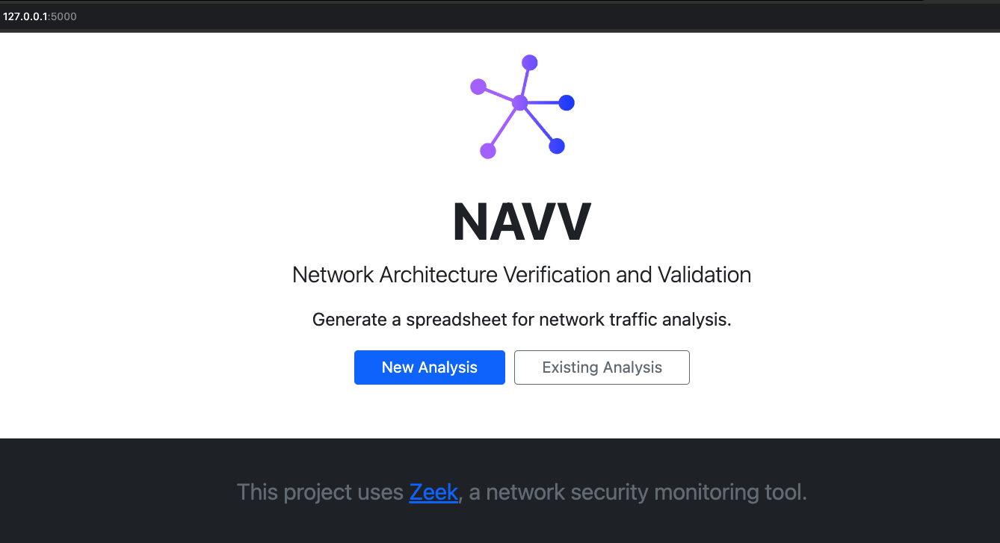
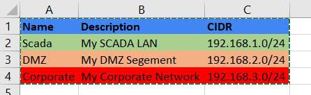

# NAVV #

The **NAVV** (**N**etwork **A**rchitecture **V**erification and **V**alidation) tool creates a spreadsheet for network traffic analysis from PCAP data and Zeek logs, automating Zeek analysis of PCAP files and the collation of Zeek logs to create a summary or network traffic in an XLSX-formatted spreadsheet. After manually updating the spreadsheet with names and color codes for network segments (by CIDR-formatted address groups) and hosts (by IP address), running the tool again will integrate these labels and color coding into the spreadsheet to aid in conducting an evaluation of the network traffic. 

### What's New in 4.0 ###
- **eleVADR JSON Report Generation:** NAVV 4.0 now automatically creates a structured `eleVADR` JSON report for advanced ingestion.
- **Increased Zeek Log Visibility:** Enhanced analysis with dedicated spreadsheet tabs for DNS, OT protocols (Modbus, DNP3, BACnet, ENIP), and Remote Access protocols (SSH, RDP).
- **Auto-Segmentation:** Automatically discovers and categorizes network segments from traffic patterns.
- **Purdue Model Graphing & Analysis:** Tracks Purdue level boundaries, detecting cross-level violations and generating Macro-level Sankey diagrams.
- **Automated IP Geolocation:** Automatically downloads and updates DB-IP Lite databases, no longer requiring manual GeoLite2 downloads.

* [Requirements](#Requirements)
* [Installation](#Installation)
    * [Prerequisites](#Prerequisites-All-Environments)
    * [Production](#Production)
    * [Development](#Development)
* [Usage](#Usage)
    * [CLI](#CLI)
    * [Browser](#Browser)
    * [Analysis](#Analysis)
* [AI-Driven Development](#AI-Driven-Development)
* [Docker](#Docker)
* [Copyright](#Copyright)
* [Contact](#Contact)

[](https://pypi.python.org/pypi/navv/)
[](https://github.com/cisagov/network-architecture-verification-and-validation/actions)

## Requirements ##

- This project only works on Linux or MacOS environments (or Windows via WSL)
- **Zeek** must be installed and available in `PATH`: [Get Zeek](https://zeek.org/get-zeek/)
- **Python 3.10** or later
- **Python Dependencies:**
  - `pandas`, `openpyxl`, `click`, `flask`, `maxminddb`, `netaddr`, `lxml`, `tqdm`
  - (These are automatically installed via `pip install navv`)
- **IP Geolocation Database:** NAVV 4.0 now automatically downloads and caches **DB-IP Lite** databases (City and ASN) by default. A local MaxMind GeoLite2 database is still supported as an optional offline fallback using the `-g` flag.

## Installation ##

### Prerequisites (All Environments)

NAVV requires **Zeek** to be installed and available in your system's `PATH`.

> [!WARNING]
> **Windows Users:** NAVV relies on Linux tools (`zeek` and `zeek-cut`). You must install and run NAVV from within a Windows Subsystem for Linux (WSL) environment (such as Ubuntu). Running NAVV natively on Windows Python is not supported.

**Ubuntu / WSL Setup Example:**
If you are using Ubuntu (or WSL with Ubuntu), you can install Zeek from the official repositories. Note that Zeek typically installs to `/opt/zeek/bin`, which must be added to your `PATH`.
```shell
# Install Zeek (refer to Zeek docs for the latest instructions)
sudo apt update && sudo apt install zeek

# Add Zeek to your PATH
export PATH=$PATH:/opt/zeek/bin

# To make this persistent, add the export line to your shell configuration (e.g., ~/.bashrc or ~/.zshrc):
echo 'export PATH=$PATH:/opt/zeek/bin' >> ~/.bashrc
source ~/.bashrc
```

For other platforms, please refer to the [official Zeek installation guide](https://zeek.org/get-zeek/).

### Production ###

If you would like to use the NAVV tool, it is recommended you install it from PyPI.

#### Installing NAVV

The recommended method for installing the NAVV CLI tool on modern Linux environments (including WSL) is using `pipx`. This automatically isolates the application and prevents "externally-managed environment" errors.

- Install using `pipx` (Recommended):
  ```shell
  pipx install navv
  ```
  *(Note: If your system doesn't have `pipx`, you can install it via `sudo apt install pipx` or refer to the [pipx docs](https://pipx.pypa.io/stable/installation/))*

- Install using `pip` (Alternative):
  ```shell
  python3 -m pip install --user navv
  ```
  *(If you need a specific version, use: `python3 -m pip install --user navv==4.0.0`)*

#### Upgrading NAVV

To upgrade an existing installation of NAVV to the latest version (4.0.x):

- If you installed via `pipx`:
  ```shell
  pipx upgrade navv
  ```

- If you installed via `pip`:
  ```shell
  python3 -m pip install --user --upgrade navv
  ```

### Development ###

If you intend to develop the NAVV tool or run it from source:

- Clone this repository:
  ```shell
  git clone https://github.com/cisagov/network-architecture-verification-and-validation.git
  cd network-architecture-verification-and-validation
  ```
- Setup and activate your local virtual environment:
  ```shell
  python3 -m venv .venv
  source .venv/bin/activate
  ```
- Install in editable mode with development dependencies:
  ```shell
  python3 -m pip install -e ".[dev]"
  ```

Verify the NAVV tool has been installed by running `navv` in your console:

```shell
NAVV: Network Architecture Verification and Validation 4.0.0
Usage: navv [OPTIONS] COMMAND [ARGS]...

  Network Architecture Verification and Validation.

Options:
  --version   Show the version and exit.
  -h, --help  Show this message and exit.

Commands:
  generate  Generate excel sheet.
  launch    Launch the NAVV GUI.
```

## Usage ##

### CLI ###

To run the NAVV tool in the CLI (Command Line Interface), Run the command: `navv generate`

Below are the available options and commands for `navv generate`:
```shell
Usage: navv generate [OPTIONS] CUSTOMER_NAME

  Generate excel sheet.

Options:
  -o, --output-dir TEXT  Directory to place resultant analysis files in.
                         Defaults to current working directory.
  -p, --pcap TEXT        Path to pcap file. NAVV requires zeek logs or pcap.
                         If used, zeek will run on pcap to create new logs.
  -z, --zeek-logs TEXT   Path to store or contain zeek log files. Defaults to
                         current working directory.
  -g, --geoip-db TEXT    Path to GeoLite2 database file or directory (MMDB format).
                         If not specified, DB-IP Lite databases will be
                         automatically downloaded and cached.
  -h, --help             Show this message and exit.
```

### Browser ###

To launch the NAVV tool in the browser, simply run: `navv launch`

This will automatically launch the tool into your default browser.



The user will have two options:

- Generate a New Analysis:
  - Simply upload your PCAP file or a zipped file of your Zeek logs
  - Click Run Analysis
  - An excel sheet will be generated and downloaded via your browser

- Upload an Existing Analysis
  - Modify your generated excel spreadsheet, See [Analysis](#Analysis)
  - Upload your spreadsheet and your zipped Zeek logs file

### Analysis ###

Identifying network segments and hosts

Adding information about network segments and/or inventory can assist in packet capture analysis. Open the NAVV-generated `.xlsx` file and navigate to the `Segments` tab. Enter the relevant network segments and choose background colors for the corresponding cells. For example: 



Save your changes and re-run the NAVV tool with the `-z` option on the directory containing the Zeek log files and `.xlsx` file. The tool will modify the contents of the spreadsheet, recoloring the contents of the `Analysis` tab to match the segments specified in the `Segments` tab. This simplifies the task of identifying cross-segment traffic.

When available, the NAVV tool will use responses for queries found in Zeek's `dns.log` file to populate the `Src_Desc` and `Dest_Desc` fields in the `Analysis` tab. When DNS information is not available, it is possible to provide this information manually in the `Inventory` tab. Note that color formatting from the `Inventory` tab is applied **after** that from the `Segments` tab. Again, saving changes to the spreadsheet file and re-running the NAVV tool with the `-z` option will update the spreadsheet with the new inventory information and color formatting.

## AI-Driven Development ##

> [!NOTE]
> **Independent Operation:** While NAVV 4.0 leverages advanced AI-driven development workflows for maintenance and architectural integrity, **no AI tools, agents, or subscriptions are required to install, run, or use the software.** It is a standard Python application built for reliability in offline and secure environments.

This project is maintained using a **Four Pillars** AI strategy, ensuring high code quality and architectural integrity. This approach allows AI agents (like Google Antigravity) to operate with deep context and precision.

- **[Graphify](https://github.com/Dbones202/graphify)**: Generates a searchable knowledge graph of the codebase. A current snapshot of the architectural health and community clusters is available in [graphify-out/GRAPH_REPORT.md](./graphify-out/GRAPH_REPORT.md).
- **[GitNexus](https://github.com/Dbones202/gitnexus)**: Orchestrates advanced code analysis, providing API route mapping and blast-radius assessment for every major refactor.
- **GitHub Integration**: Leverages the GitHub MCP for systematic issue management and PR coordination following Sentry-style engineering practices.
- **Anytype Persistence**: Development context, End-of-Session (EOS) summaries, and long-term memory are synced to **Donovan's Space** via the Anytype MCP for cross-device consistency.

### Working with AI Agents ###

If you are contributing using an AI agent:
1. **Initialize the Graph**: Run the `graphify` skill to ensure your local knowledge graph is in sync with the latest code changes.
2. **Impact Analysis**: Use `gitnexus` to check the impact of your proposed changes before committing.
3. **EOS Sync**: Always run the `eos-summary` workflow to sync progress to Anytype.

## Docker ##

See [`docker/README.md`](./docker/README.md) for setup and instructions for running the NAVV tool in Docker.

## Copyright ##

[NAVV](https://github.com/cisagov/network-architecture-verification-and-validation) is Copyright 2024 Battelle Energy Alliance, LLC, licensed under the BSD-3 Clause License.

See [`LICENSE`](./LICENSE) for the terms of its release.

Developers, by contributing to this software project, you are agreeing to the following terms and conditions for your contributions:

* You agree your contributions are submitted under the BSD 3-Clause license.
* You represent you are authorized to make the contributions and grant the license. If your employer has rights to intellectual property that includes your contributions, you represent that you have received permission to make contributions and grant the required license on behalf of that employer.

## Contact ##

Contact information of maintainer(s):

[Seth Grover](mailto:seth.grover@inl.gov?subject=NAVV)

[Donovan Nichols](mailto:donovan.nichols@inl.gov?subject=NAVV)
